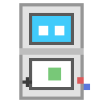
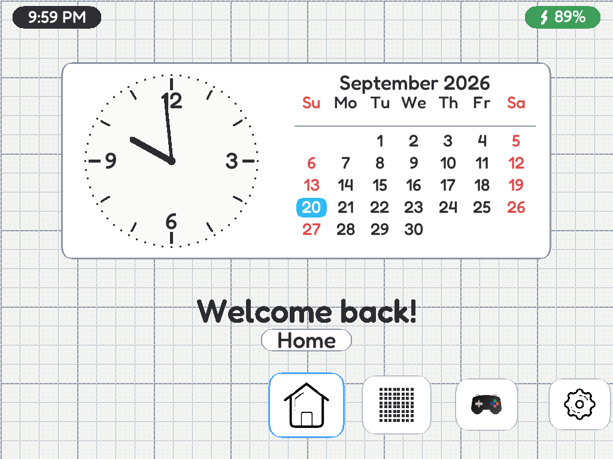
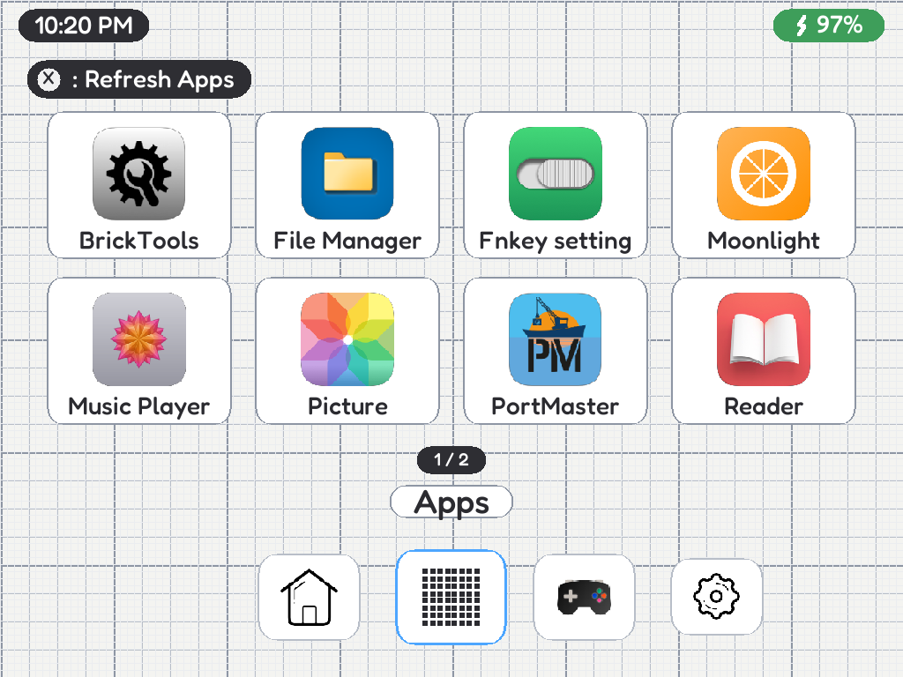
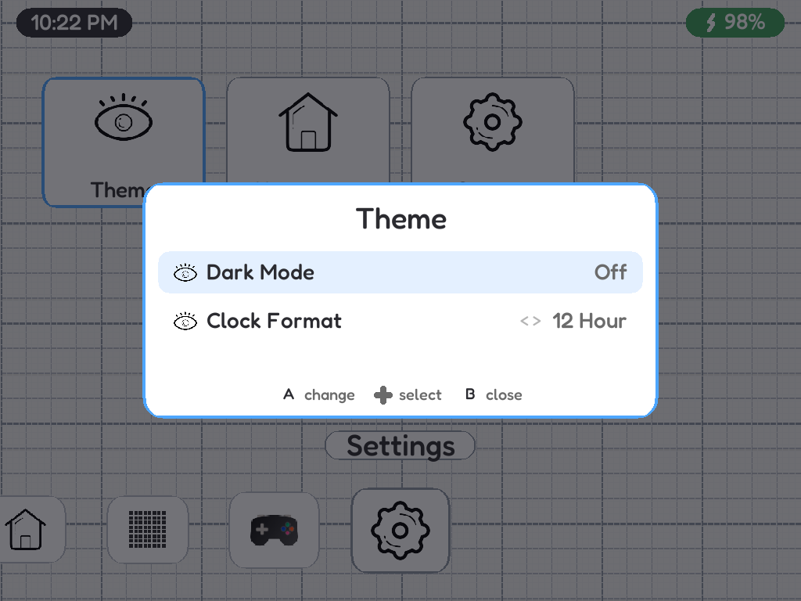
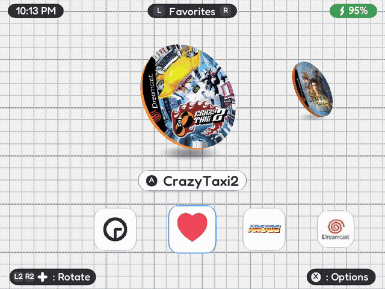

<h1 align="center">NDSUI</h1>

<p align="center">
  
</p>

<p align="center">
  <a href="https://github.com/TimeATronics/ndsui/commits/main"></a>
  <a href="https://github.com/TimeATronics/ndsui/blob/main/LICENSE"></a>
  <a href="https://github.com/TimeATronics/ndsui/stargazers"></a>
  <a href="https://github.com/TimeATronics/ndsui/issues"></a>
</p>

A Nintendo DS styled launcher for the **TrimUI Brick** running the stock OS.
It browses your existing `Roms/`, `Emus/` and `Apps/` layout, shows every
console as a 3D cartridge carousel and launches games through the same stock
launch scripts MainUI uses - while staying completely out of the way of the
system: brightness, volume, LEDs and radios stay owned by the stock OSD.

|  |  |
| --- | --- |
|  |  |
|  |  |

## Features

- DS-styled UI: notebook-paper background, pixel font, cards, pills and
  button-glyph hints; light + dark theme
- **Games** - every `Emus/*/config.json` with games becomes a console in the
  3D carousel (era-correct cartridges, discs for CD systems), with box art,
  Recently Played, Favorites, search keyboard and a launch-core picker
- **Apps** - tile grid of everything in `Apps/` and `/usr/trimui/apps`
- **Settings** - minimal on purpose: Theme (dark mode, clock format),
  Homepage toggles, System (default launcher, quit, power off)
- Stock friendly: MENU+SELECT OSD hotkey, power-button handling and the
  stock OSD keep working; NDSUI never writes display/LED/sound/WiFi/BT state
- **Boot straight into NDSUI** (optional): a script in `System/starts/` hands
  over from MainUI, so NDSUI runs as a normal app session - quitting or
  crashing always falls back to MainUI
- Light on resources: ~10% of one core and ~45 MB RAM at rest

## Install (TrimUI Brick)

1. Download `ndsui-brick-v1.0.zip` and extract it to the root of the SD card,
   so you get `/mnt/SDCARD/Apps/NDSUI/...`
2. On the Brick, open **MainUI → Apps → NDSUI**. That's it.

Optional - boot straight into NDSUI:

3. Copy `System/starts/ndsui_boot.sh` from the zip to
   `/mnt/SDCARD/System/starts/` (create the folder if needed)
4. In NDSUI: **Settings → System → Default Launcher → NDSUI**, then reboot.
   MainUI flashes for a couple of seconds, then hands over.

Going back / recovery:

- In NDSUI: **Settings → System → Default Launcher → MainUI**, press
  **Quit NDSUI** - or on a PC delete `Apps/NDSUI/use_as_launcher` from the SD
  card (or create the file `System/no_ndsui`) and boot to MainUI again.

Requirements: stock Brick firmware and the usual `Roms/` + `Emus/` SD layout
(the same one MainUI uses). Nothing on the rootfs is modified.

## Controls

| Button | Action |
| --- | --- |
| D-Pad | navigate |
| A | select / launch |
| B | back (and close overlays) |
| X | options (games) · refresh (apps) |
| Y | search / favorite (games options) |
| L / R | previous / next console |
| L2 / R2 + D-Pad | rotate the 3D model |
| Power (hold) | stock behaviour: kill the app, long hold powers off |

## Build from source

Cross toolchain (aarch64) + TrimUI sysroot in WSL:

```sh
make          # device binary  -> dist/ndsui   (make strip to strip it)
make host     # desktop build  -> dist/ndsui-host
bash scripts/deploy.sh         # NDSUI_IP=<brick ip> to copy to the device
```

## Repository layout

```
src/core     Json, Systems/Games scanning, Settings/Recents, Device, Launcher
src/ui       Canvas (software surface + one streaming texture), Theme, Shell,
             Carousel (software 3D raster), Components, Images, fonts
device/      config.json, launch.sh, icon, boot/ndsui_boot.sh
assets/      NDS12 + Fredoka fonts, 3D cartridge models (.obj), stock skin
tools/       helpers used to convert/preview the 3D models and box art
media/       screenshots + showcase video
```

## Credits

- Fredoka (SIL OFL) - `assets/Fredoka-OFL.txt`

NDSUI is not affiliated with Nintendo. Game art is loaded from your own SD
card and is not part of this repository.
